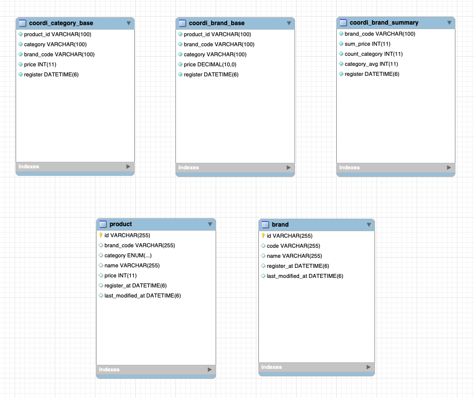

# 코디 샵

## 프로젝트 개요
- 브랜드 / 브랜드 별 제품 등록 수정 삭제
- 제품 가격 기준의 통합 / 브랜드 세트 상품들의 추천 정보 제공

## API 제공 기능
- 제품 검색
- 제품 등록
- 제품 수정
- 제품 삭제
- 브랜드 검색
- 브랜드 등록
- 브랜드 수정
- 브랜드 삭제
- 전 브랜드 통합 카테고리 별 최저 가격 상품 조합 세트 조회 (aka 통합 세트 추천)
- 카테고리 세트 기준 최저가 단일 브랜드 및 브랜드 카테고리 상품 조합 세트 조회 (aka 브랜드 세트 추천)
- 카테고리 기준 최고 / 최저가 상품 조회 (aka 카테고리 상품 추천)
- SWAGGER Document : http://localhost:8080/swagger-ui/index.html

## 환경 / 빌드 및 실행
- Kotlin, Spring boot
- H2 embedded DB
  - H2 WEB CONSOLE : http://localhost:8080/h2-console/
  - ADMIN / PASS : sa / 
- gradle
  - multi module structure
  - parent
    - common
    - catalog
    - api
- 빌드
```shell
$ ./gradlew clean :api:build
$ java -jar ./api/build/libs/api-0.0.1-SNAPSHOT.jar
```
- 테스트
```shell
$ ./gradlew test
```

## 프로젝트 상세 설명
### 기본
- 멀티 모듈과 헥사고날 아키텍쳐 가이드를 맞춰가는 방향으로 구현했습니다.
  - 부모 모듈 : cstore 란 이름의 빌드 세팅 모듈
  - config 모듈 : 여러 도메인 모듈에서 공통으로 사용될 법한 클래스 모음 모듈
  - catalog 모듈 : 제품 / 브랜드 관리 / 제품 추천 등의 카탈로그 도메인 기능이 구현된 모듈
  - api 모듈 : catalog 모듈을 import 하여 API 로 제공하는 프리젠테이션 모듈
- 도메인 레이어를 중심으로 놓는 기준으로, 도메인 / 어플리케이션 레이어는 양방향 포팅 , 그외 레이어에서 도메인으로의 접근은 단방향 포팅 수행을 기본 규칙으로 했습니다.

### catalog module
- 크게 세가지의 서비스로 나뉘며 쿼리 / 커맨드 유즈 케이스를 분리하여 외부로 제공합니다.
  - Product - Product Query / Product Command
  - Brand - Brand Query / Brand Command
  - Coordination - Coordination Query / Coordination Brand
- DB 접근 방식은 기본적인 CUD 는 JPA 를 사용했고, 추천 (Coordination) 조회 및 데이터 생성을 위한 복잡한 쿼리 실행은 MyBatis 를 사용했습니다.
  - 기본 데이터 셋과 통계용 스키마 (JPA Entity 를 사용하지 않는) 는 resources/data-*.sql 파일로 지정되어 있습니다.
- 어플리케이션이 최초 기동 시 기본 데이터셋 기준 초기 통계를 생성합니다.
- 추천 데이터 제공은 통계를 기반으로 제공되며, 3개의 테이블로 구성됩니다.
  - 브랜드 기반 최고 최저가 제품 관리 테이블 (coordi_brand_base)
  - 카테고리 내 최고 최저가 제품 관리 테이블 (coordi_category_base)
  - 브랜드 기준 추천 점수 (카테고리 세트 기준 최저가) 관리 테이블 (coordi_brand_summary)
  - 추천 데이터의 제공은 통계 데이터가 최종 갱신 완료 될 때마다 최신 데이터가 반영되고, 갱신 작업 중에는 이전 통계 데이터를 기반으로 제공되는 것을 기본 골자로 합니다. 
  - 통계의 생성 / 갱신은 다음의 플로우를 기본으로 합니다.
    1. 제품 테이블 기준 -> 브랜드 기반 최저가 제품 관리 테이블 갱신
    2. 브랜드 기반 최저가 제품 관리 테이블 기준 -> 카테고리 최고 최저가 제품 관리 테이블 갱신
    3. 브랜드 기반 최저가 제품 관리 테이블 기준 -> 브랜드 추천 점수 관리 테이블 갱신 (2와 동시)
  - 각 통계의 갱신은 갱신 시마다 갱신된 데이터 셋의 key 를 기준으로 묶음 관리되며, 이 key 는 시간을 기준으로 생성됩니다.
  - 추천 데이터 조회 요청은 가장 최근에 생성된 key 묶음의 데이터 셋 내에서 조회하여 리턴 됩니다.
  - 통계 갱신은 브랜드 / 제품 데이터의 변형이 될 때마다 이벤트가 발생하여 갱신됩니다.
  - 추천 데이터 셋의 요구 사항에 부합하는 데이터가 모자랄 시엔 `데이터 생성 중입니다.` 란 API 응답으로 대체됩니다.
- 이벤트의 발생 / 처리 흐름
  - 제품 등록 / 수정 / 삭제 시 -> 브랜드 기반 최저가 제품 관리 테이블 갱신 -> 나머지 2 통계 테이블 연쇄 갱신
  - 브랜드 삭제 시 -> 브랜드 기반 최저가 제품 관리 테이블 갱신 -> 나머지 2 통계 테이블 연쇄 갱신
  - 이벤트의 구성
    - 도메인 이벤트 : 제품 / 브랜드 변경 시 발생
    - 작업 이벤트 : 도메인 이벤트 핸들러에 의해 상태에 따라 테이블 갱신 / 연관 도메인 데이터 삭제 작업 이벤트가 발생되고, 작업 이벤트 핸들러에 의해 실제 작업이 수행됩니다.
    - ex. 브랜드 삭제가 발생하면, 다음과 같은 순서로 이벤트 발생 및 작업이 진행됩니다.
      - 브랜드 삭제 도메인 이벤트 발생 -> 브랜드 소속 제품 삭제 작업 이벤트 발생 및 수행
      - 제품 대량 변경 도메인 이벤트 발생 -> 브랜드 기반 최저가 제품 관리 테이블 통계 갱신 작업 이벤트 발생 및 수행

### 테스트 구성
- 모킹 / 순수 객체 생성 기준 유닛 테스트
- 스프링 빈 결합 상태의 통합 테스트 


### 추가 고려 사항
- 통계의 지속적인 갱신을 기반으로 추천 데이터를 조회하도록 구현되었으나, redis sorted set 을 기반으로 추천 리스트를 적정한 사이즈로 수동 관리하면 보다 간편한 로직으로 구현할 수 있을 것으로 보입니다.
  - 특히 브랜드 추천 점수 관리는 이런 형태가 더 타당할 것으로 보입니다.
- 데이터 셋의 짧은 캐싱 시간을 유지하면 반응 속도 및 DB 부하에 도움이 될 것이지만, H2 기반 환경을 고려하여 적용은 배제하였습니다.


## DB 스키마


